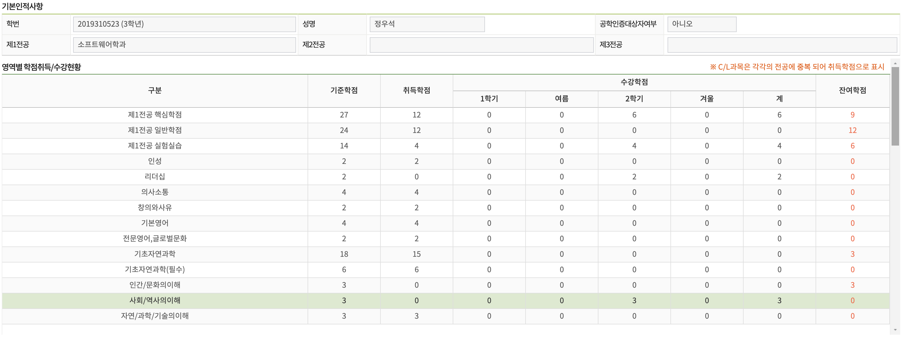

# 졸업스꾸
[Link of our Wesite](https://w00shh.github.io/)
[Youtube](https://youtu.be/awkAR2I4puQ)

# 🤲 Team20

최윤채: [cyunchaeskku@gmail.com](mailto:cyunchaeskku@gmail.com)

이승현: [haltsh@naver.com](mailto:haltsh@naver.com)

정우석: [jerry7780@g.skku.edu](mailto:jerry7780@g.skku.edu)

### 💻 Application Type

Web Site

### 💭 Motivation

1. **한눈에 보기 어려운 남은 교양 및 전공 이수학점**

GLS 상에 있는 졸업요건충족현황조회 탭은 잔여학점을 확인할 수 있지만, 구분만 확인할 수 있고, 잦은 교양구분 변경으로 인하여, 정확히 어떤 수업을 들어야하는지 판별하기 어려웠습니다.

1. **너무 많은 전공인정 타과 과목으로 인한 과목 혼동 실습 과목 존재**

소프트웨어학과 특성상 많은 전공인정 타과 과목이 너무 많아 원하는 과목을 찾기가 어렵고, 실습과목을 찾기 어려웠습니다.

1. **로드맵으로 인한 획일화된 시간표, 수강신청 난이도**

2번 항목과 같은 문제로, 다수의 학생들이 로드맵을 따라 이수를 선호하는 경우가 많습니다. 따라서, 같은 과목을 선택하는 학생의 비율이 높아져 수강신청의 난이도가 높아지고, 수강신청 실패 시 대안을 찾기 어려워 하는 학생이 많았습니다.
심지어는, 대안을 선수지식이 많이 필요한 전공인정 타과 과목을 급하게 신청하여 고통을 받는 학생도 있었습니다.

## ⚙️ Features

1. **User의 이수 과목 확인**

   성적증명서 엑셀 파일을 JS를 활용하여 파싱하여 정보를 얻은 후 잔여 학점 표시

2. **가시성 + 접근성이 좋은 잔여 학점 표시**

   오픈소스 프레임워크인 Bootstrap의 Accordion와 같은 Component를 사용하여 기존 잔여학점 확인 탭보다 가시성, 접근성 있게 잔여학점 확인

3. **남은 학점 추천 시스템 제공**

   남은 교양 및 전공의 구분을 보여주고, 해당 버튼 클릭 시 구분에 따른 과목을 보여주는 시스템

   - 해당 과목의 ‘에브리타임’ 강의평가 탭으로 바로 이동 가능하도록 링크 달아둠

### 👤**Fictional User**

주 타겟층은 졸업을 앞둔 고학번 학생으로 생각하였으나, 시간표를 짤 때, 대개 졸업필수 교양을 고려하여 시간표를 짜기 때문에, 성균관대학교 전 학년의 학생들이 기대 고객층이라고 판단하였습니다.

**Usage Scenario는 다음과 같습니다:**

1. 유저가 성적증명서 엑셀 파일을 웹사이트에 업로드
2. 프로그램이 엑셀 파일 파싱후, 잔여 학점 확인
3. 유저의 남은 졸업요건 출력
4. 유저에게 방안 출력 (ex. 전공/교양 과목 추천)

### 👨‍💻 Application Example

1. 메인 화면

1. 남은 과목 확인 화면

1. About Us

## 👍 Task Assignment

성적증명서 엑셀 파일 파싱 & 남은 학점 등 계산 → 최윤채

웹 UI 디자인 및 웹 개발 → 정우석

데이터베이스 구축 → 이승현
